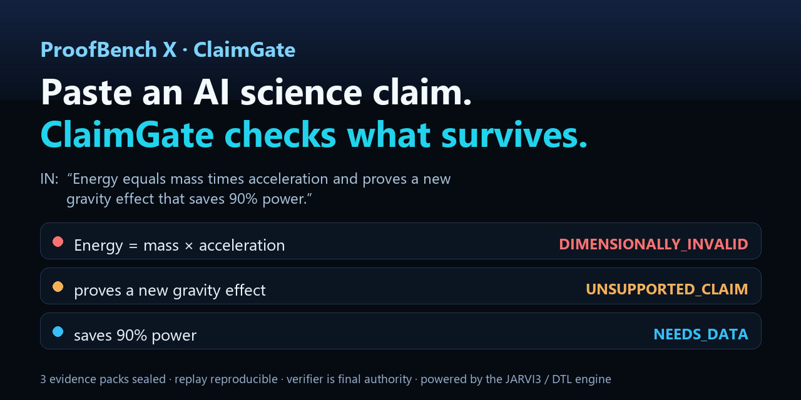

# ProofBench X & ClaimGate — Public Benchmark (Prototype)

## Paste an AI science claim. ClaimGate checks what survives.

*ProofBench X · ClaimGate — proof-aware claim verification (powered by the JARVI3 / DTL engine).*



```
python -m proofbench_x claim "Energy equals mass times acceleration and proves a new gravity effect that saves 90% power."
→ DIMENSIONALLY_INVALID · UNSUPPORTED_CLAIM · NEEDS_DATA   (3 evidence packs, replay reproducible)
```

**→ [60-second demo: DEMO.md](DEMO.md)**

---

**ProofBench X and ClaimGate test whether mathematical and scientific claims can survive verification, hidden-assumption checks, counterexamples, evidence packing and replay. They do not prove scientific truth; they preserve what was checked, what failed, what needs evidence and what must be validated by simulation or experiment.**

This is **verified-claim infrastructure**, not a model-answer leaderboard and not a "hardest math" benchmark. The deterministic verifier — never a model — decides correctness. A model may explain, route, or format; it can never override the verification gate.

> **Prototype status.** This stack was first built in an isolated sandbox and has been ported additively into the JARVI3 repository. **Prototype benchmark numbers must be re-run inside the real repo before they are cited.** No result is leaderboard-eligible until an uncontaminated, post-implementation **holdout** is generated (see `CONTAMINATION_POLICY.md`).

## What's here

| Gate / layer | What it checks |
|---|---|
| **SuperMath / ProofBench X v1/v2** | exact arithmetic, symbolic invariance, adversarial reasoning, certificate stability, model-override resistance |
| **Research Hardening** | domain assumptions, hidden conditions, counterexample witnesses, proof-object construction |
| **PhysicsGate** | unit/dimensional coherence, simple limits, conservation templates, uncertainty propagation, bounded counterexamples |
| **TheoryGate** | variable definition, known-law consistency, falsifiability, prediction-bearing structure |
| **EvidencePack + ReproGate** | sealed, hash-stamped verification records; drift / missing-seed / missing-code-hash detection |
| **ReplayRunner** | executes repro commands (no shell) and checks results replay without drift |
| **ClaimGate** | extracts claims from messy text, routes them to gates, seals evidence packs, reports what passed / failed / needs evidence |

## Run it (real repo)

```
python -m proofbench_x selftest
python -m proofbench_x run --v1 --json
python -m proofbench_x run --physics --json
python -m proofbench_x run --theory --json
python -m proofbench_x run --math-hardening --json
python -m proofbench_x run --evidence --json
python -m proofbench_x run --replay --json
python -m proofbench_x claim "paste any claim here"
```

## Honest framing — what this is NOT

It does **not** prove new mathematics, prove new physics, solve open problems, replace experiment or simulation, or claim a public-leaderboard rank. Open problems (e.g. "prove the Riemann Hypothesis") are **refused** as `UNSUPPORTED_CLAIM`, never reported as proved.

See `BENCHMARK_CARD.md`, `DATASET_CARD.md`, `CONTAMINATION_POLICY.md`, `LEADERBOARD_SPEC.md`, `LIMITATIONS.md`, `RED_TEAM_CASES.md`, `REPRODUCIBILITY.md`, and `EXAMPLE_REPORTS/`.
